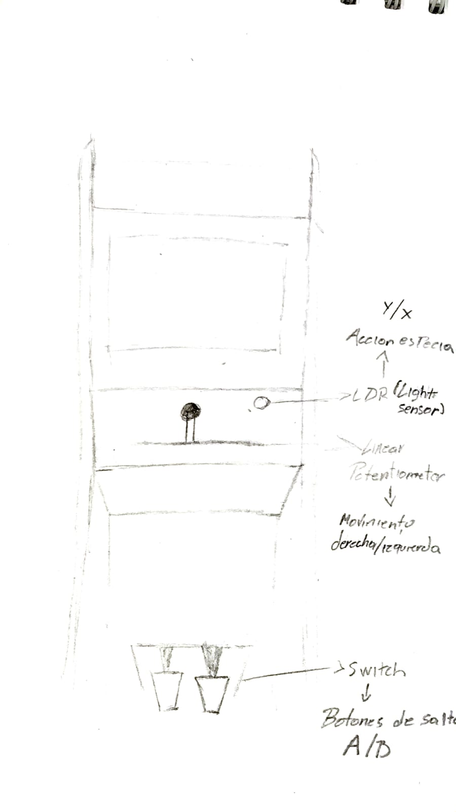

# mario-remix
el super mario word con arduino esplora

---


---

# 📄 Product Requirements Document (PRD)

### Proyecto: **Mario Remix Controls**

**Plataforma:** Arduino Esplora + Node.js + p5.js + Emulador SNES

---

## Visión General


**Mario Remix Controls** es un sistema de control alternativo que reemplaza el mando clásico de *Super Mario World* usando los sensores integrados del **Arduino Esplora**. El sistema debe ser capaz de recibir datos en tiempo real desde el Esplora conectado a un **puerto COM** (ejemplo: COM12), procesarlos mediante un servidor intermedio en **Node.js** con la librería **p5.serialport**, y enviarlos al **navegador** para su visualización y posterior uso como entradas del juego.

---

## Controles y Entradas

* **Botón físico del Esplora (switch):** Salto (tecla A).
* **Potenciómetro deslizable:** Movimiento horizontal (izquierda/derecha).
* **Sensor de luz (LDR):** Acción de correr/disparar (tecla Y).
* *(Opcional)* Joystick analógico → Control adicional para versiones futuras.

---

## Requerimientos del Prototipo

* **Hardware:**

  * Arduino Esplora.
  * Cable USB para conexión en puerto COM (ejemplo: COM12).

* **Software:**

  * **Arduino IDE** para cargar el sketch en el Esplora.
  * **Servidor Node.js** que use **p5.serialport** para recibir datos del Esplora y transmitirlos al navegador vía WebSocket.
  * **Cliente web en p5.js** para visualizar, mapear y usar los datos como controles del emulador.
  * Emulador SNES (ZSNES, Snes9x, RetroArch).

* **Compatibilidad:**

  * El sistema debe reconocer el puerto serie disponible (ejemplo COM12 en Windows o `/dev/ttyUSB0` en Linux/Mac).
  * Debe existir comunicación bidireccional estable entre Arduino y navegador con una latencia <100 ms.

---

## Mecánica del Juego

* El **Arduino Esplora** envía continuamente valores desde sus sensores a través del puerto COM.
* El **servidor Node.js** captura los datos con `p5.serialport` y los reenvía al navegador.
* El navegador interpreta los datos y los convierte en eventos de control (flechas, tecla A, tecla Y).
* El emulador SNES recibe estas entradas como si fueran de un teclado físico.

---

## Forma de Juego y Diagrama

El jugador interactúa con el Esplora, los datos viajan por el puerto COM → Node.js → navegador → emulador.

**Diagrama de flujo simplificado:**

```
 [Botón Esplora] ----\
                      \
 [Potenciómetro] -------> [Arduino Esplora] --> [Puerto COM12] --> [Node.js + p5.serialport] --> [Navegador p5.js] --> [PC/Emulador SNES] --> [Super Mario World]
                      /
     [Sensor de luz]-/
```

---


